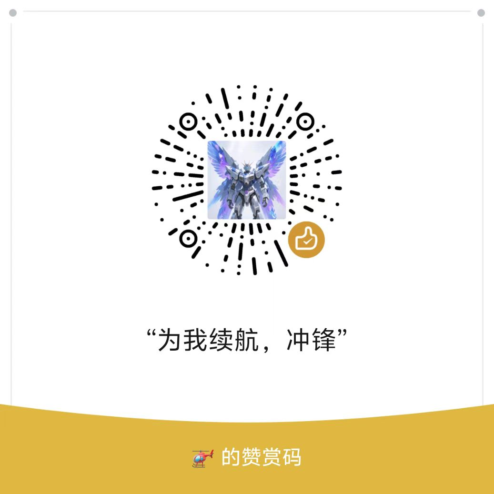

# 山海·云烟


山海·云烟是一个运行在本地的中文 AI 写作应用。它把小说创作过程拆成几个清楚的工作台：项目资料、章节正文、创作助手、多 Agent 流程、无限续写、短篇创作、小说转剧本、知识库和 Wiki。

这个仓库提供的是本地应用源码。默认不提供云端账号、多用户权限、在线托管服务，也不面向公网部署。


## 主要能力

### 项目资料

每个小说都是项目级的数据隔离，每个项目都有独立的数据目录。项目内可以管理：

- 大纲
- 角色档案
- 世界观设定
- 道具物品
- 事件线
- 细纲设定
- 章纲设定
- 正文摘要
- 自定义资料

这些内容会保存到本地 `data/projects/<project_id>/`，不会默认上传到任何云服务。

### 创作助手

多agent模式里右侧 Copilot 面板用于日常对话和创作操作。它支持：

- 多轮对话
- 流式输出
- 会话管理
- 顶部支持快速切换模型
- `@` 引用项目中的角色、章节和设定
- 将创作结果同步回资料库或章节

### 本地多 Agent 流程

多agent模式的创作流程由本地 Router 和协调器组织并分发给各个子agent

当前主要角色包括：

- `RouterAgent`：判断用户意图，决定进入聊天、资料生成、续写、润色或创作流程。
- `NovelCoordinator`：管理创作状态、检查点、上下文和任务执行。
- `WorldbuilderAgent`：生成世界观。
- `OutlinerAgent`：生成大纲和结构。
- `ChapterWriterAgent`：撰写章节。
- `PolisherAgent`：润色文本。
- `EvaluatorAgent`：评估质量与一致性。
- `CharacterBuilderAgent`：生成角色档案。
- `ChapterSettingBuilderAgent`：生成章纲。

### 无限续写

无限续写是单独的写作工作台，适合持续生成章节。它支持：

- 新建或导入续写会话
- 按上下文继续写
- 按灵感或纠偏意见调整方向
- 重写章节
- 编辑章节
- 标记死亡角色
- 导出 TXT、Markdown、DOCX

### 短篇创作

短篇创作不是一条简单提示词，而是分步骤流程：

- 分析输入材料
- 生成融合方案
- 生成梗概
- 生成大纲
- 生成章节
- 做质量检查和连贯性复审
- 生成标题和标签
- 组装并导出成稿

### 小说转剧本

小说转剧本工作台支持导入文本，按整体或章节批次转换，并可对不满意的批次重新转换。结果可以导出为 TXT、Markdown 或 DOCX。

### 知识库与 Wiki

项目里有两套辅助知识能力：

- 知识库：用于导入文档、分块、向量检索、全文检索和章节索引。
- Wiki：用于页面化管理知识，支持页面编辑、搜索、图谱、反向链接、lint、review 和 ingest。

知识库嵌入来源可以使用硅基流动 API，也可以安装本地 ONNX 模型包。

## 运行方式

准备 Python 3.10 或更高版本。

```bash
pip install -r requirements.txt
```

复制环境变量文件：

```bash
cp .env.example .env
```

Windows PowerShell：

```powershell
Copy-Item .env.example .env
```

最小 API 配置示例：

```env
OPENAI_API_KEY=你的 API Key
OPENAI_API_BASE=https://api.openai.com/v1
OPENAI_MODEL=gpt-4
HOST=0.0.0.0
PORT=5656
```

启动：

```bash
python run.py
```

Windows 也可以使用：

```text
启动山海·云烟.bat
```

默认地址：

```text
http://localhost:5656
```

如果端口被占用，启动脚本会自动寻找后续可用端口，请以终端输出为准。

## 配置模型

可以在 `.env` 中写入基础配置，也可以启动后在「设置」里管理 API。

当前主流程支持：

- OpenAI Chat Completions 兼容接口
- OpenAI Responses 接口
- Anthropic Messages 接口

设置页可以维护多个 API 配置、模型列表、激活配置，以及为不同 Agent 指定不同模型。

## 打包

Windows 发布只保留两个安装版 EXE：

```bash
pip install pyinstaller
python build_release.py
```

输出文件：

- `dist/山海·云烟_v1.0_安装包_轻量版.exe`：不内置本地 ONNX 向量模型，体积更小。
- `dist/山海·云烟_v1.0_安装包_本地模型版.exe`：内置 `novel_agent/models/embedding/default` 下的本地 ONNX 向量模型。


## 目录说明

```text
run.py
  应用启动入口。

novel_agent/web/app.py
  FastAPI 应用工厂。

novel_agent/web/routes/
  Web API 路由。

novel_agent/web/static/
  原生 JavaScript 前端模块。

novel_agent/web/templates/index.html
  主页面模板。

novel_agent/agents/
  Router、创作 Agent、LLM 客户端和消息总线。

novel_agent/workflow/
  创作协调器、任务池、工作流和运行状态。

novel_agent/knowledge_base/
  向量检索、全文检索、元数据和混合检索。

novel_agent/wiki/
  Wiki 页面、图谱、检索、审核和迁移。

skills/
  本地 Skill 目录。

data/
  本地项目数据，默认不提交。
```

## 本地数据与安全

默认数据目录是 `data/`。这里会保存项目内容、章节、会话、统计、日志和知识库数据。

不要把以下内容上传到公开仓库：

- `.env`
- `data/`
- 日志文件
- 构建产物
- 私人项目素材
- 本地测试目录和测试配置
- GitHub 个人访问令牌或其他凭证

本应用默认面向本机单用户使用。如果要部署到局域网或公网，请自行增加认证、HTTPS、访问控制、备份和安全审计。

## 许可

本项目采用自定义非商业源码许可。

允许：

- 个人学习
- 研究
- 评估
- 非商业创作
- 非商业目的下的修改和分发

禁止未经授权：

- 商业部署
- 商业集成
- SaaS 化提供
- 用于客户项目
- 用于收费内容生产服务
- 打包售卖

商业使用需要事先取得书面授权。完整条款见 [LICENSE](./LICENSE)。

第三方依赖、模型、图标、字体和外部 API 服务仍受其各自许可证或服务条款约束。

## 交流与支持

- QQ 交流群：[点击加入](https://qm.qq.com/q/E25rrnPONy)
- 群号：`760758525`

如果这个项目对你有帮助，也可以请作者喝杯咖啡：


