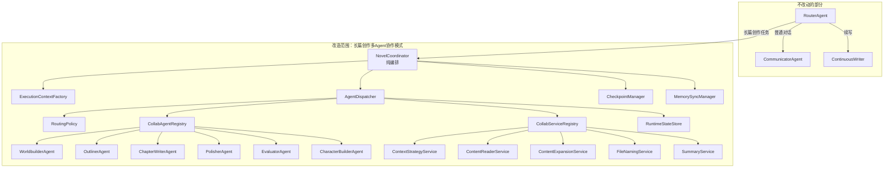

# 多Agent协作模式架构改造方案

> 版本：v2.2 | 日期：2026-04-27 | 状态：评审修订稿
>
> **改造范围**：仅限 `novel_agent/workflow/` 下的多Agent协作模式（长篇创作）。
> 无限续写、短篇创作、剧本创作，以及 Router / Communicator / ContinuousWriter 等独立工作模式*
## 一、改造边界与目标

### 1.1 不动的部分（独立工作模式）

| 模块 | 文件 | 说明 |
|------|------|------|
| RouterAgent | `agents/router_agent.py` | 入口路由，不改 |
| CommunicatorAgent | `agents/communicator.py` | 对话模式，不改 |
| ContinuousWriter | `agents/continuous_writer.py` | 无限续写模式，不改 |
| 短篇 / 剧本相关模式 | 各自模式文件 | 不纳入多Agent运行时 |
| BaseAgent | `agents/base_agent.py` | 基类保持现状 |
| MessageBus | `agents/message_bus.py` | 保持现状，继续复用 |

### 1.2 要改的部分（长篇创作多Agent协作模式）

| 模块 | 文件 | 当前问题 | 改造方向 |
|------|------|------|------|
| NovelCoordinator | `workflow/coordinator.py` (3683行) | 职责过多，兼顾编排/调度/状态/上下文拼装 | 拆为纯编排入口 |
| 协作辅助节点 | `agents/collab_sub_agents.py` | 伪Agent混入调度空间 | 降级为普通 service |
| 能力注册表 | `agents/capability_registry.py` | 仅能提供候选，不能保证分配正确 | 保留为能力声明层，新增路由规则层 |
| 任务池 | `workflow/task_pool.py` | 只表达任务状态，不表达路由依据 | 复用并补充路由/上下文元数据 |
| 合同 | `workflow/contracts.py` | 缺少统一上下文合同 | 增加执行上下文合同或新增执行上下文模块 |

### 1.3 本次补强后的核心目标

这次改造不再把重点只放在“拆文件”上，而是优先解决两个根问题：

1. **任务分配要更稳定地落到正确的子Agent / 正确的任务节点**
2. **任务分发后，上下文、缓存、记忆等协作信息不能丢**

### 1.4 非目标

1. 不追求“全系统统一运行时”
2. 不把短篇、剧本、无限续写纳入多Agent运行时
3. 不把性能 / 资源浪费优化作为第一优先级
4. 不为了把 `Coordinator` 压到某个固定行数而牺牲可读性与稳定性

---

## 二、核心设计总览（补强版）

### 2.1 当前问题

```text
NovelCoordinator（3683行）
├── 直接持有 11 个 Agent / helper 实例
├── create_novel 流程直接调用 agent.execute()
├── 协作任务流程通过 _run_autonomous_task() 选 Agent
├── 章节任务市场用 working_context 临时拼装上下文
├── capability_registry 只能提供“候选列表”
└── 调度决策、上下文传递、运行时状态三者耦合在一起
```

### 2.2 改造后

```text
NovelCoordinator（~900-1200行，纯编排逻辑）
│
├── AgentDispatcher（统一执行入口）
│   ├── RoutingPolicy（决定“这个任务该给谁”）
│   ├── AgentRegistry（真正可接任务的 Agent）
│   ├── ServiceRegistry（普通工具服务，不参与调度）
│   ├── RuntimeStateStore（当前任务链 / 路由结果 / 上下文快照）
│   ├── dispatch(envelope) 统一执行
│   ├── fallback / lifecycle event / execution trace
│   └── task_pool 状态同步
│
├── ExecutionContextFactory（统一上下文装配）
├── CheckpointManager（检查点）
├── MemorySyncManager（记忆同步）
└── TrendService（热点搜索，可选）
```

### 2.3 三个关键原则

1. **Dispatcher 不是简单搬运 `_run_autonomous_task()`**
   - 它必须承载统一执行入口，但不独占全部业务判断
2. **能力声明 ≠ 路由决策**
   - capability registry 只提供“谁可能能做”
   - RoutingPolicy 决定“当前这个任务应该给谁做”
3. **上下文必须合同化**
   - 不能继续只靠 `working_context.update(...)` 这类隐式拼装

---

## 三、统一调用层：AgentDispatcher

### 3.1 职责

`AgentDispatcher` 是**统一执行入口**，但它不直接决定全部业务规则。

**负责：**

1. 管理多Agent协作模式下的 Agent / Service 生命周期
2. 统一 `dispatch()` 接口，替代散落的直接 `execute()`
3. 根据 `RoutingPolicy` 的决策执行任务
4. 统一处理 fallback、事件广播、执行轨迹、任务池状态同步
5. 将执行结果写回运行时状态

**不负责：**

1. 决定章节应该生成哪些任务（这是 Coordinator / Task Market 的职责）
2. 决定上下文 source-of-truth（这是 ExecutionContextFactory / Context Contract 的职责）
3. 把普通 service 当成可调度 Agent

### 3.2 详细设计

```python
# 新文件：workflow/agent_dispatcher.py

@dataclass
class DispatchResult:
    success: bool
    agent_name: str
    result: Dict[str, Any]
    route_reason: str = ""
    context_snapshot_id: str = ""
    fallback_used: bool = False
    original_error: str = ""


class AgentDispatcher:
    """
    多Agent协作模式的统一执行入口。
    """

    def __init__(
        self,
        progress_callback=None,
        routing_policy=None,
        agent_registry=None,
        service_registry=None,
        runtime_state=None,
    ):
        self.progress_callback = progress_callback
        self.routing_policy = routing_policy or RoutingPolicy.default()
        self.agent_registry = agent_registry or CollabAgentRegistry()
        self.service_registry = service_registry or CollabServiceRegistry()
        self.runtime_state = runtime_state or RuntimeStateStore()

        self._initialize_agents()
        self._initialize_services()

    async def dispatch(self, envelope: TaskExecutionEnvelope) -> DispatchResult:
        """
        统一分发入口：
        1. 校验上下文合同
        2. 通过 RoutingPolicy 产出 RouteDecision
        3. 执行 Agent
        4. 处理 fallback / 事件 / 任务池 / 运行时状态
        """
        envelope.validate_required_context()

        decision = self.routing_policy.resolve(
            task_type=envelope.task_type,
            stage=envelope.stage,
            context=envelope.context,
            fallback_agent_name=envelope.fallback_agent_name,
        )

        selected = self.agent_registry.get(decision.agent_name)
        snapshot_id = self.runtime_state.record_dispatch(decision, envelope)

        await self._emit_event("sub_agent_started", {
            "agent": decision.agent_name,
            "task_type": envelope.task_type,
            "title": envelope.title,
            "route_reason": decision.reason,
            "context_snapshot_id": snapshot_id,
        })

        try:
            result = await selected.execute(
                envelope.input_data,
                context=envelope.context.to_agent_context(),
            )
            self.runtime_state.record_result(snapshot_id, result)
            await self._emit_event("sub_agent_completed", {
                "agent": decision.agent_name,
                "task_type": envelope.task_type,
                "title": envelope.title,
                "context_snapshot_id": snapshot_id,
            })
            return DispatchResult(
                success=True,
                agent_name=decision.agent_name,
                result=result,
                route_reason=decision.reason,
                context_snapshot_id=snapshot_id,
            )
        except Exception as exc:
            return await self._handle_failure(decision, envelope, snapshot_id, exc)
```

### 3.3 为什么不能只靠 capability registry

当前 registry 更适合做“能力声明缓存”，不适合直接承担最终分配决策。

因为真正的分配正确性至少依赖：

- `task_type`
- 当前 `stage`
- 需要的上下文是否齐全
- 是否允许 fallback
- 当前任务是否只允许长篇协作模式内某个 agent 接手

因此：

- `CapabilityRegistry`：保留，负责“候选发现”
- `RoutingPolicy`：新增，负责“最终决策”

---

## 四、任务路由规则层：RoutingPolicy

### 4.1 目标

显式回答两个问题：

1. **这个任务该给谁做？**
2. **为什么是它，而不是别的 agent？**

### 4.2 设计原则

路由规则不只按 capability 匹配，而是按“任务 + 阶段 + 上下文前置条件”决策。

```python
# 新文件：workflow/routing_policy.py

@dataclass
class RouteRule:
    task_type: str
    allowed_agents: List[str]
    preferred_agent: str
    fallback_agents: List[str]
    required_context_keys: List[str]
    stage: Optional[str] = None
    review_required: bool = False


@dataclass
class RouteDecision:
    agent_name: str
    fallback_agent_names: List[str]
    reason: str
    missing_context_keys: List[str]


ROUTE_TABLE = [
    RouteRule(
        task_type="build_world",
        stage="worldbuilding",
        allowed_agents=["Worldbuilder"],
        preferred_agent="Worldbuilder",
        fallback_agents=[],
        required_context_keys=["project_brief"],
    ),
    RouteRule(
        task_type="write_chapter",
        stage="writing",
        allowed_agents=["ChapterWriter"],
        preferred_agent="ChapterWriter",
        fallback_agents=["Polisher"],
        required_context_keys=["world", "characters", "chapter_outline"],
    ),
]
```

### 4.3 路由决策流程

1. 先按 `task_type + stage` 命中规则
2. 再检查 `required_context_keys`
3. 不满足上下文前置条件时，不直接执行，而是：
   - 触发补上下文任务
   - 或显式 fail-fast
4. 最后才结合 capability registry 校验 agent 是否仍然有效

### 4.4 改造收益

这层是为了直接解决用户最在意的问题：

- **分错 Agent / 分错任务**
- **把缺上下文的任务错误地下发出去**

---

## 五、统一上下文契约：ExecutionContext / TaskExecutionEnvelope

### 5.1 当前问题

现在章节任务市场中的上下文主要靠过程变量拼装：

- `working_context`
- `loaded_context`
- `previous_summary`
- `permanent_memory`
- `aux_memory`

这会带来两个问题：

1. 同一个上下文字段谁是 source-of-truth 不明确
2. 分发前后上下文 merge 规则不稳定，容易丢

### 5.2 改造方案

新增两个核心数据结构：

```python
# 新文件：workflow/execution_context.py

@dataclass
class CollabExecutionContext:
    project_id: str = ""
    stage: str = ""
    world: Dict[str, Any] = field(default_factory=dict)
    characters: List[Dict[str, Any]] = field(default_factory=list)
    outline: Dict[str, Any] = field(default_factory=dict)
    chapter_outline: Dict[str, Any] = field(default_factory=dict)
    previous_summary: str = ""
    previous_chapters: List[Dict[str, Any]] = field(default_factory=list)
    loaded_context: Dict[str, Any] = field(default_factory=dict)
    aux_memory: Dict[str, Any] = field(default_factory=dict)
    permanent_memory: Dict[str, Any] = field(default_factory=dict)
    cache_meta: Dict[str, Any] = field(default_factory=dict)
    source_of_truth: Dict[str, str] = field(default_factory=dict)

    def to_agent_context(self) -> Dict[str, Any]:
        return {
            "world": self.world,
            "characters": self.characters,
            "outline": self.outline,
            "chapter_outline": self.chapter_outline,
            "previous_summary": self.previous_summary,
            "previous_chapters": self.previous_chapters,
            "loaded_context": self.loaded_context,
            "aux_memory": self.aux_memory,
            "permanent_memory": self.permanent_memory,
        }


@dataclass
class TaskExecutionEnvelope:
    task_type: str
    stage: str
    title: str
    input_data: Dict[str, Any]
    context: CollabExecutionContext
    fallback_agent_name: str = ""
    required_context_keys: List[str] = field(default_factory=list)

    def validate_required_context(self) -> None:
        ...
```

### 5.3 建议的 source-of-truth 规则

| 字段 | 建议真相源 |
|------|------|
| `world` | `world_manager` / world context |
| `characters` | `character_manager` |
| `outline` | `context_manager` / outline rows |
| `chapter_outline` | 当前章节任务输入 |
| `previous_summary` | 上一章摘要持久化结果 |
| `aux_memory` | 辅助记忆检索结果 |
| `permanent_memory` | 项目级持久记忆快照 |
| `loaded_context` | content reader 的标准化加载结果 |

### 5.4 merge 规则

1. `world / characters / outline / chapter_outline`：**结构化覆盖**
2. `previous_summary`：**单值覆盖**
3. `loaded_context / aux_memory / permanent_memory / cache_meta`：**命名空间内 merge**
4. 任何 agent 返回值都**不能直接无约束 `update` 整个 working_context**
5. dispatch 前必须执行上下文校验

### 5.5 这层解决什么问题

它是为了直接解决：

- 分发出去时到底带没带全上下文
- 带了哪些缓存和记忆
- 哪一步把上下文覆盖丢了

即便用户不优先要求可视化诊断，系统内部也必须先稳定。

---

## 六、辅助节点降级 + Agent / Service 双注册表

### 6.1 为什么要降级

当前这些节点继承 `BaseAgent`，每个都会：

- 初始化 `AsyncOpenAI` 客户端（但从不使用）
- 注册到 `CapabilityRegistry`
- 被注入知识库
- 设置回调处理器

它们实际上是普通逻辑服务，不应该和真正可接任务的 Agent 混在一个调度空间里。

### 6.2 降级方案

```text
新文件：workflow/collab_services.py

class ContextStrategyService      # 原 ContextStrategyAgent
class ContentReaderService        # 原 ContentReaderAgent
class ContentExpansionService     # 原 ContentExpansionAgent
class FileNamingService           # 原 FileNamingAgent
class SummaryService              # 原 SummaryOrchestratorAgent
```

### 6.3 双注册表设计

```python
# 新文件：workflow/collab_registry.py

class CollabAgentRegistry:
    """仅注册真正可接任务的 Agent"""


class CollabServiceRegistry:
    """仅注册普通工具服务，不参与路由选择"""
```

### 6.4 Scoped Registry 原则

长篇创作多Agent协作模式应有自己的 scoped registry / routing space：

- 不把短篇 / 剧本 / 无限续写模式混进来
- 不让协作模式长期依赖“全局单例 + 所有模式共用一个候选池”

因此建议：

1. 现有 `agents/capability_registry.py` 保留作通用能力声明层
2. 新增协作模式专用 registry / router
3. `Coordinator` 只从协作模式自己的 registry 中取 agent

---

## 七、Coordinator 拆分（修订版）

### 7.1 从 Coordinator 提取的模块

| 新模块 | 提取内容 | 预计行数 |
|--------|---------|---------|
| `workflow/agent_dispatcher.py` | 统一执行入口 + fallback + 事件广播 + 执行轨迹 | ~350行 |
| `workflow/routing_policy.py` | 路由规则表 + RouteDecision | ~200行 |
| `workflow/execution_context.py` | 上下文合同 + envelope + merge/validate | ~250行 |
| `workflow/runtime_state.py` | 当前调度链 / 上下文快照 / 执行结果索引 | ~200行 |
| `workflow/checkpoint_manager.py` | 检查点 load/save/update | ~150行 |
| `workflow/memory_sync.py` | 记忆同步 + 快照导出 + 事件记录 | ~250行 |
| `workflow/collab_services.py` | 5个辅助服务（从 collab_sub_agents 迁移） | ~350行 |
| `workflow/collab_registry.py` | AgentRegistry + ServiceRegistry | ~150行 |

### 7.2 Coordinator 保留的内容（目标 ~900-1200 行）

```text
NovelCoordinator
├── __init__()                     — 组装各模块
├── create_novel()                 — 创作主流程编排
├── resume_novel()                 — 恢复创作
├── execute_project_ready_tasks()  — 项目级任务执行
├── _execute_chapter_task_market() — 章节级任务编排
├── pause() / resume() / cancel()  — 控制接口
├── switch_to_project()            — 项目切换
└── set_knowledge_base()           — 委托给 dispatcher / registry
```

> 说明：这里不再强求“必须缩到 800 行”，重点是**把不该留在 Coordinator 的职责移走**。

### 7.3 拆分后的 Coordinator 示意

```python
class NovelCoordinator:
    def __init__(self, project_dir=None, progress_callback=None, ...):
        self.project_dir = project_dir or Path(...)

        self.routing_policy = RoutingPolicy.default()
        self.agent_registry = CollabAgentRegistry()
        self.service_registry = CollabServiceRegistry()
        self.runtime_state = RuntimeStateStore()
        self.context_factory = ExecutionContextFactory(self.project_dir)

        self.dispatcher = AgentDispatcher(
            progress_callback=progress_callback,
            routing_policy=self.routing_policy,
            agent_registry=self.agent_registry,
            service_registry=self.service_registry,
            runtime_state=self.runtime_state,
        )

        self.checkpoint = CheckpointManager(self.project_dir)
        self.memory = MemorySyncManager(...)

    async def create_novel(self, novel_type, theme, ...):
        creation_context = self.context_factory.build_project_context(...)

        world_result = await self.dispatcher.dispatch(
            TaskExecutionEnvelope(
                task_type="build_world",
                stage="worldbuilding",
                title="世界观构建",
                input_data={...},
                context=creation_context,
                required_context_keys=["project_brief"],
            )
        )

        chapter_context = self.context_factory.build_chapter_context(...)
        chapter_result = await self.dispatcher.dispatch(
            TaskExecutionEnvelope(
                task_type="write_chapter",
                stage="writing",
                title="第5章创作",
                input_data={...},
                context=chapter_context,
                fallback_agent_name="ChapterWriter",
                required_context_keys=["world", "characters", "chapter_outline"],
            )
        )
```

---

## 八、改造后的调用链路



---

## 九、文件变更清单（修订版）

| 操作 | 文件路径 | 说明 |
|------|---------|------|
| **新增** | `workflow/agent_dispatcher.py` | 统一执行入口 + DispatchResult |
| **新增** | `workflow/routing_policy.py` | 路由规则层 |
| **新增** | `workflow/execution_context.py` | 上下文合同 + TaskExecutionEnvelope |
| **新增** | `workflow/runtime_state.py` | 运行时状态快照 |
| **新增** | `workflow/checkpoint_manager.py` | 从 coordinator 提取 |
| **新增** | `workflow/memory_sync.py` | 从 coordinator 提取 |
| **新增** | `workflow/collab_services.py` | 辅助节点降级后的服务类 |
| **新增** | `workflow/collab_registry.py` | AgentRegistry + ServiceRegistry |
| **修改** | `workflow/coordinator.py` | 改为纯编排入口 |
| **修改** | `workflow/__init__.py` | 更新导出 |
| **修改** | `workflow/task_pool.py` | 补充路由原因/上下文快照元数据（如有必要） |
| **修改** | `workflow/contracts.py` | 补充执行上下文合同或与新模块对齐 |
| **修改** | `agents/capability_registry.py` | 退回“能力声明层”定位，供路由层辅助使用 |
| **不动** | `agents/router_agent.py` | 不在改造范围 |
| **不动** | `agents/communicator.py` | 不在改造范围 |
| **不动** | `agents/continuous_writer.py` | 不在改造范围 |
| **不动** | `agents/base_agent.py` | 保持现状 |
| **不动** | `agents/message_bus.py` | 保持现状 |

---

## 十、执行步骤（修订版）

### Step 1：先定义路由规则层（1天）

1. 新建 `workflow/routing_policy.py`
2. 先把现有 `build_world` / `build_outline` / `write_chapter` / `evaluate_chapter` / `polish_chapter` 等任务的规则表列全
3. 明确每个任务的：
   - preferred agent
   - fallback agent
   - required context keys
   - stage

> 先做这一步，是为了优先解决“分错 Agent / 分错任务”。

### Step 2：定义统一上下文合同（1天）

1. 新建 `workflow/execution_context.py`
2. 把 `working_context`、`loaded_context`、`previous_summary`、`aux_memory`、`permanent_memory` 明确收口
3. 定义 merge / validate 规则
4. 在 dispatch 前做必需上下文校验

> 先做这一步，是为了优先解决“分发后上下文信息丢失”。

### Step 3：创建 AgentDispatcher（1-2天）

1. 新建 `workflow/agent_dispatcher.py`
2. 将 `_run_autonomous_task()` 中真正属于“执行入口”的逻辑迁移过来
3. 接入 `RoutingPolicy`
4. 接入任务池状态同步、事件广播、fallback、执行轨迹

### Step 4：创建双注册表与辅助服务（1天）

1. 新建 `workflow/collab_registry.py`
2. 新建 `workflow/collab_services.py`
3. 将 `collab_sub_agents.py` 中 5 个 helper 迁移为普通类
4. 真正可接任务的对象只进入 `CollabAgentRegistry`

### Step 5：提取 RuntimeState / Checkpoint / MemorySync（1-2天）

1. 新建 `workflow/runtime_state.py`
2. 新建 `workflow/checkpoint_manager.py`
3. 新建 `workflow/memory_sync.py`
4. 将 coordinator 中的运行时快照、检查点、记忆同步逻辑迁出

### Step 6：改造 Coordinator 主流程（2-3天）

1. `create_novel()` 统一改用 `TaskExecutionEnvelope + dispatcher.dispatch()`
2. `_execute_chapter_task_market()` 改为“先组装上下文 envelope，再 dispatch”
3. 删除 Coordinator 中不再需要的散落逻辑

### Step 7：回归测试与灰度迁移（1-2天）

- [ ] 创作流程（世界观→角色→大纲→章节）
- [ ] 项目级任务执行（`execute_project_ready_tasks`）
- [ ] 章节级任务市场（`_execute_chapter_task_market`）
- [ ] 暂停 / 恢复 / 取消
- [ ] 检查点保存 / 恢复
- [ ] WebSocket 子Agent状态推送
- [ ] 知识库注入
- [ ] 路由规则是否命中正确 Agent
- [ ] 缺失上下文时是否 fail-fast，而不是错发任务
- [ ] `previous_summary` / `loaded_context` / `aux_memory` / `permanent_memory` 是否完整透传

---

## 十一、验收标准

### 11.1 必须满足

1. **分配正确**
   - 主流程和章节任务市场都不再各自维护一套隐式“选人逻辑”
   - 路由规则显式可读

2. **上下文不丢**
   - dispatch 前上下文合同可校验
   - dispatch 后上下文回写有规则

3. **Agent / Service 边界清晰**
   - helper 不再进入 agent 候选池

4. **Coordinator 不再承担调度决策**
   - 它只负责编排，不负责“这个任务到底给谁”

### 11.2 加分项

1. 可记录 `route_reason`
2. 可记录 `context_snapshot_id`
3. 任务执行失败时能知道是：
   - 路由错误
   - 上下文缺失
   - agent 执行异常

---

## 十二、风险控制

1. **渐进式迁移**：每个 Step 独立一个 Git commit，可单独回退
2. **先补路由和上下文合同，再拆类**：避免“结构变漂亮了，但错分任务和丢上下文还在”
3. **旧代码保留过渡期**：`collab_sub_agents.py` 可先标记 `@deprecated`，待新链路稳定后删除
4. **接口兼容**：`create_novel` / `execute_project_ready_tasks` / `set_knowledge_base` 等外部接口签名保持不变
5. **不要一次性把所有逻辑搬空**：先迁移世界观 / 角色 / 大纲 / 单章写作几条主链，再扩到全部章节任务市场

---

## 十三、v2.2 运行时弊端修复（2026-04-27 新增）

基于对当前代码的深度审查，v2.2 在 v2.1 基础上新增以下修复项：

### 13.1 移除并行写作模式

**原因**：并行写作存在上下文竞争、共享可变状态等问题，且实际无并行写作需求。

**变更**：
- 删除 `coordinator.py` 中的 `_write_chapters_parallel()` 方法
- 删除 `parallel_chapters` 配置参数
- `create_novel()` 和 `resume_from_checkpoint()` 统一使用串行写作
- 简化 `__init__` 中的并行配置逻辑

### 13.2 强制 LLM 意图识别，废弃规则兜底

**原因**：规则兜底的意图识别（如关键词匹配、正则提取）准确率低，容易误判。

**变更**：
- `RouterAgent` 的意图识别**必须调用 LLM 模型**，不再回退到规则匹配
- 删除所有基于关键词/正则的兜底意图识别逻辑
- 意图识别失败时显式报错，而非静默回退到错误的路由

### 13.3 修复上下文隐式覆盖问题

**问题**：`execute_chapter_task_market_loop` 中 `working_context` 被 `merged_context` 整体替换，后一个任务的结果覆盖前一个任务的上下文修改。

**变更**：
- 在 `execute_chapter_task_market_loop` 中实现显式 merge 策略
- 每个子任务完成后，只将该任务的产出字段 merge 到 `working_context`，而非整体替换
- `CollabExecutionContext.apply_task_result()` 扩展支持更多任务类型的结果回写

### 13.4 修复路由规则"假路由"问题

**问题**：`RoutingPolicy.resolve()` 优先走 capability_registry 候选，忽略了 `preferred_agent_name`。

**变更**：
- `RoutingPolicy.resolve()` 优先使用规则表中的 `preferred_agent_name`
- `capability_registry` 仅作校验（确认 preferred agent 是否仍然可用），不作为首选决策源
- 当 preferred agent 不可用时，才降级到 capability_registry 候选列表

### 13.5 减少磁盘 IO 频率

**问题**：一次 dispatch 触发 4+ 次磁盘 IO，一章写作至少 28 次。

**变更**：
- 引入批量写入机制：章节任务市场循环中，只在循环结束后统一持久化任务池状态
- 合并 `_append_execution_event` 的两套重复实现（`AgentDispatcher` 和 `RuntimeStateStore`）
- 上下文快照增加大小限制，避免单个快照包含完整世界观+角色+大纲数据

### 13.6 提升扩写和总结质量

**问题**：`ContentExpansionService` 和 `SummaryService` 只做纯文本拼接，没有调用 LLM。

**变更**：
- `ContentExpansionService` 改为调用 LLM 进行智能扩写，LLM 失败时直接报错
- `SummaryService` 改为调用 LLM 生成真正的剧情总结，LLM 失败时直接报错
- 移除纯规则模式降级方案（规则拼接无实际价值）

### 13.7 明确 Agent / Service 边界

**问题**：`CollabAgentRegistry` 同时包含真正的 Agent 和 Service-backed 参与者。

**变更**：
- `CollabAgentRegistry` 只注册真正调用 LLM 的 Agent（Worldbuilder、Outliner、ChapterWriter、Polisher、Evaluator、CharacterBuilder）
- Service（ContextStrategy、ContentReader、ContentExpansion、FileNaming、SummaryOrchestrator）不进入路由空间
- `ServiceBackedCollabParticipant` 不再实现 `accepts_task()` / `estimate_cost()`，避免被误选为路由候选

---

## 十四、一句话结论

`v2.2` 的核心变化是：

> **在 v2.1 的"统一执行入口 + 显式路由规则 + 统一上下文合同"基础上，**
> **移除并行写作、强制 LLM 意图识别、修复上下文覆盖和路由假路由问题、减少磁盘 IO、提升扩写/总结质量**，
> **从而让长篇创作多Agent协作模式在实际运行中更加稳定可靠。**
